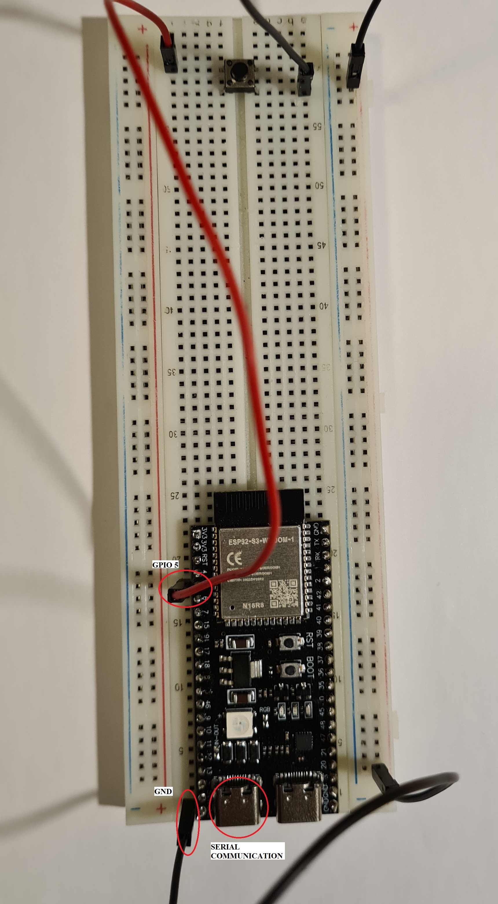

# Ubuquitous-Chainsaw Server Configuration

## Prerequisites
- Espressif installed on your system, preferably the ESP-IDF extension for Visual Studio Code

## Setup project
### Using Visual Studio Code (VSC)
- Open server directory in/using VSC
- Open ESP-IDF Terminal (located at the bottom toolbar)
- Run the command: python ConfigureServer.py

## Transferring ECC keys
Connect the microcontroller with an usb-c cable to the computer running the client. 
If there are no stored ECC keys on the microcontroller it will initialize the left USB-C connector in CDC mode. Waiting for keys to be sent over serial.
You can then generate the ECC keys from the client directly, using the GUI.
## Deleting stored ECC keys
In order to reset the microcontroller and remove the stored ECC keys you need a push button.

* GPIO 5 -> Button.
* Button -> GND.

